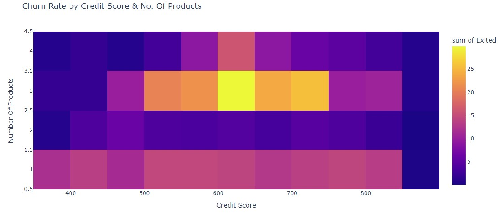
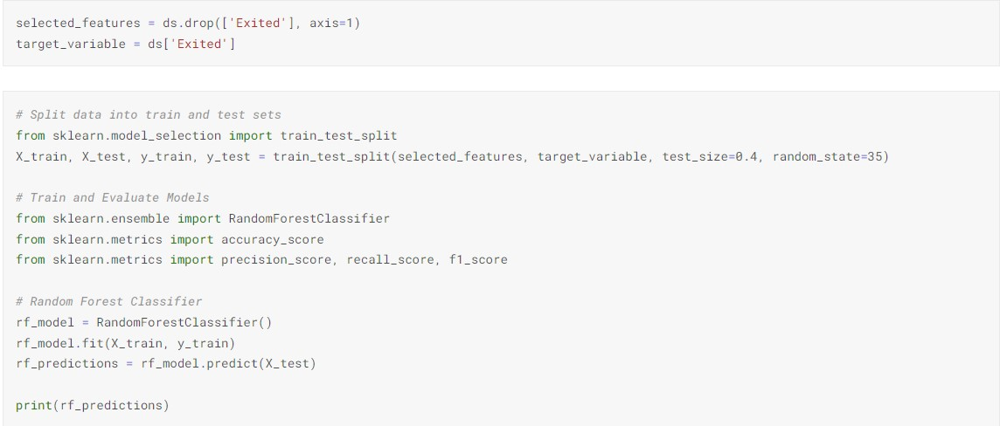

# Bank-Customer-Churn-Prediction

**In This project** we will explore and analyze customer data to identify potential churn predictors. Through exploratory analysis, we aim to uncover key insights that can help us understand the factors contributing to customer churn.

Once we have identified relevant features, we will employ the powerful Random Forest Classification technique to build a predictive model. Random Forest is a robust and effective algorithm that can handle complex datasets and provide accurate predictions.

Our ultimate goal is to leverage data-driven insights to develop a reliable churn prediction model, empowering the bank to proactively address customer churn and enhance customer retention strategies. Let's dive into the data and uncover valuable patterns that will aid in making informed business decisions.

## About the Data ##
we are working with a dataset that comprises 18 different columns and consists of 10,000 rows of valuable data. The dataset encompasses various customer-related information, including CustomerID, Surname, CreditScore, Geography, Gender, Age, Tenure, Balance, NumOfProducts, HasCrCard, IsActiveMember, EstimatedSalary, Exited, Complain, Satisfaction Score, Card Type, and Point Earned.

## Exploratory Data Analysis ##
Let's look at some data and see what are the top factors that affect the customer churn rate.

In the bank's product portfolio, we have 4 types of products. The majority of customers possess either 1 or 2 products, while only a few customers have 3 or 4 products.

Upon analyzing customer churn rates, we found that individuals with 2 products exhibit the lowest churn rate, indicating a higher level of loyalty. On the other hand, customers with 3 products experience the highest churn rate, followed by those with just 1 product. This insight highlights the importance of understanding customer behavior and tailoring retention strategies based on their product usage.

Among the bank's customer base, those between the ages of 45 and 70 exhibit a higher tendency to leave the institution, indicating a need for targeted retention efforts for this age group. Additionally, the data reveals that female customers have a higher churn rate compared to male customers, suggesting the importance of addressing gender-specific factors that might influence customer retention.

Older customers may consider switching banks due to life changes, retirement, or a desire for more suitable financial products and services.

Indeed, the data highlights a compelling relationship between high credit scores, multiple product ownership, and higher churn rates. A higher credit score not only empowers customers with more financial opportunities but also allows them to explore better service options. Similarly, customers with multiple products gain valuable insights and knowledge about different offerings, making them more discerning when evaluating their banking choices. This combination of factors leads to a higher churn rate, as these customers are more likely to seek out and switch to banks offering enhanced services and tailored products. By understanding these dynamics, banks can strategically address the needs of such customers and implement targeted retention strategies to foster long-term loyalty.

Indeed, the data presents some intriguing findings regarding customer satisfaction and churn rates. Surprisingly, the satisfaction score does not strongly correlate with customer churn. In fact, moderately satisfied customers are more likely to churn compared to the least satisfied ones. This unexpected result suggests that other factors may play a more significant role in influencing churn behavior.

On the other hand, the tenure of customers emerges as a strong indicator of churn rate. As customers stay longer with a bank, they tend to exhibit higher loyalty and are less prone to switching to other providers. Longer tenure reflects a deeper relationship with the bank, built on trust and familiarity with its offerings and services.

These insights provide valuable information for crafting effective customer retention strategies. Understanding the intricate interplay of factors influencing churn can help banks tailor their approaches to address specific customer segments' needs and preferences. By recognizing the importance of tenure and considering the satisfaction score's nuances, banks can optimize their efforts to retain valuable customers and build long-lasting relationships.

The analysis indicates that estimated salary and account balance do not strongly relate to customer churn. Other factors, such as customer satisfaction, service quality, and competitive offerings, likely play a more significant role in influencing churn decisions. Further exploration will reveal additional insights to understand customer behavior and design targeted strategies for retention and satisfaction.

The chart clearly shows that female customers tend to have a higher churn rate compared to male customers, regardless of their age. This insight suggests that gender may be a critical factor in understanding customer attrition and highlights the need to address gender-specific concerns to improve customer retention. Further analysis can help identify the underlying reasons behind this trend and devise targeted strategies for customer satisfaction and loyalty.

## Building the Model ##

Observation: The correlation analysis conducted indicates that there is no significant linear relationship between the examined features.
Reason: The lack of strong correlations suggests that customer churn is likely influenced by a combination of multiple factors rather than being driven by a single dominant factor. This finding highlights the complexity of customer behavior and emphasizes the need for a comprehensive approach to understanding and addressing churn. By considering various factors collectively, businesses can gain deeper insights into customer preferences and pain points, allowing them to implement targeted strategies for improved customer retention.

Random forest is a commonly-used machine learning algorithm trademarked by Leo Breiman and Adele Cutler, which combines the output of multiple decision trees to reach a single result. Its ease of use and flexibility have fueled its adoption, as it handles both classification and regression problems.

First, we will set the column "Exited" as our target variable, as it represents the churned customers and is the main focus of our analysis. Then, we will consider all other columns as selected features, which will help us understand the factors that contribute to customer churn. By identifying the significant features associated with customer attrition, we can build a predictive model to better address and reduce churn in the bank.

Then We conduct a train-test split on the dataset to prepare it for building and evaluating the machine-learning model. The dataset is represented by two variables: selected_features, which contains the features (input variables) for the model, and target_variable, which contains the target variable (the output or label we want to predict).

Next, we will proceed with applying the Random Forest classifier to predict customer churn. Utilizing a large number of decision trees, the Random Forest technique enhances the model's accuracy and reduces the risk of errors. By leveraging this ensemble method, we can effectively identify patterns and crucial factors that contribute to customer attrition. This will enable the bank to proactively take measures to retain valuable customers and improve overall customer satisfaction.

## Evaluating the Model ##

Based on the confusion matrix and the low number of false negatives and false positives (5 cases out of 4000 trials), we can confidently conclude that the prediction is highly accurate. The model's accuracy is over 99.87%, which indicates its effectiveness in distinguishing between churned and non-churned customers. This high level of accuracy will empower the bank to make informed decisions and implement targeted strategies to retain customers, resulting in improved overall business performance.

## Analysis and Recommendation ##
**Conduct Regular Customer Satisfaction Surveys:** By conducting regular surveys, we can identify pain points and areas for improvement, allowing us to address customer concerns promptly and effectively, thereby reducing churn rates.

**Enhance Customer Retention Programs:** To foster loyalty, we will develop personalized loyalty programs, offers, and rewards that incentivize customers to stay with the bank. Strengthening relationships and providing value-added services can significantly increase customer loyalty.

**Focus on Retaining Female Customers:** We will analyze the reasons behind higher churn rates among female customers and tailor marketing and customer service strategies to meet their specific needs and preferences.

**Strengthen Communication Channels:** Effective communication channels will be established to keep customers informed about new products, services, and updates. Personalized interactions and timely support will further enhance customer engagement.

**Offer Targeted Financial Solutions:** Analyzing the needs of customers within the 45-70 age group will enable us to provide tailored financial solutions, such as retirement planning, investment options, and specialized services, to meet their unique requirements.

**Targeted Marketing:** Leveraging insights about customer segments with higher salaries, we will tailor marketing strategies and offerings specifically for this group. This personalized approach will strengthen relationships and increase loyalty.

**Provide Value-added Products and Services:** Regularly assessing the market will help us identify emerging trends, allowing us to offer innovative products and services that differentiate the bank from competitors. We will also review and update existing offerings to remain competitive.

**Foster Trust and Transparency:** Building trust and transparency through clear communication, fair pricing, and reliable services will be a priority. Ensuring customers feel valued and have confidence in the bank's integrity and commitment to their financial well-being will result in stronger customer relationships.

