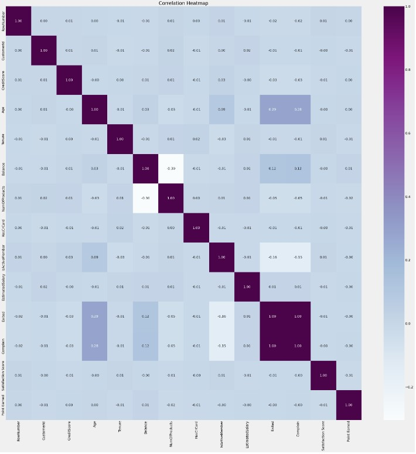

# Bank-Customer-Churn-Prediction

**In This project** we will explore and analyze customer data to identify potential churn predictors. Through exploratory analysis, we aim to uncover key insights that can help us understand the factors contributing to customer churn.

Once we have identified relevant features, we will employ the powerful Random Forest Classification technique to build a predictive model. Random Forest is a robust and effective algorithm that can handle complex datasets and provide accurate predictions.

Our ultimate goal is to leverage data-driven insights to develop a reliable churn prediction model, empowering the bank to proactively address customer churn and enhance customer retention strategies. Let's dive into the data and uncover valuable patterns that will aid in making informed business decisions.

## About the Data ##
we are working with a dataset that comprises 18 different columns and consists of 10,000 rows of valuable data. The dataset encompasses various customer-related information, including CustomerID, Surname, CreditScore, Geography, Gender, Age, Tenure, Balance, NumOfProducts, HasCrCard, IsActiveMember, EstimatedSalary, Exited, Complain, Satisfaction Score, Card Type, and Point Earned.

## Exploratory Data Analysis ##

In the bank's product portfolio, we have 4 types of products. The majority of customers possess either 1 or 2 products, while only a few customers have 3 or 4 products.

Upon analyzing customer churn rates, we found that individuals with 2 products exhibit the lowest churn rate, indicating a higher level of loyalty. On the other hand, customers with 3 products experience the highest churn rate, followed by those with just 1 product. This insight highlights the importance of understanding customer behavior and tailoring retention strategies based on their product usage.

Among the bank's customer base, those between the ages of 45 and 70 exhibit a higher tendency to leave the institution, indicating a need for targeted retention efforts for this age group. Additionally, the data reveals that female customers have a higher churn rate compared to male customers, suggesting the importance of addressing gender-specific factors that might influence customer retention.

Older customers may consider switching banks due to life changes, retirement, or a desire for more suitable financial products and services.

## Building the Model ##

Observation: The correlation analysis conducted indicates that there is no significant linear relationship between the examined features.
Reason: The lack of strong correlations suggests that customer churn is likely influenced by a combination of multiple factors rather than being driven by a single dominant factor. This finding highlights the complexity of customer behavior and emphasizes the need for a comprehensive approach to understanding and addressing churn. By considering various factors collectively, businesses can gain deeper insights into customer preferences and pain points, allowing them to implement targeted strategies for improved customer retention.

## Evaluating the Model ##

## Analysis and Recommendation ##
**Conduct Regular Customer Satisfaction Surveys:** By conducting regular surveys, we can identify pain points and areas for improvement, allowing us to address customer concerns promptly and effectively, thereby reducing churn rates.

**Enhance Customer Retention Programs:** To foster loyalty, we will develop personalized loyalty programs, offers, and rewards that incentivize customers to stay with the bank. Strengthening relationships and providing value-added services can significantly increase customer loyalty.

**Focus on Retaining Female Customers:** We will analyze the reasons behind higher churn rates among female customers and tailor marketing and customer service strategies to meet their specific needs and preferences.

**Strengthen Communication Channels:** Effective communication channels will be established to keep customers informed about new products, services, and updates. Personalized interactions and timely support will further enhance customer engagement.

**Offer Targeted Financial Solutions:** Analyzing the needs of customers within the 45-70 age group will enable us to provide tailored financial solutions, such as retirement planning, investment options, and specialized services, to meet their unique requirements.

**Targeted Marketing:** Leveraging insights about customer segments with higher salaries, we will tailor marketing strategies and offerings specifically for this group. This personalized approach will strengthen relationships and increase loyalty.

**Provide Value-added Products and Services:** Regularly assessing the market will help us identify emerging trends, allowing us to offer innovative products and services that differentiate the bank from competitors. We will also review and update existing offerings to remain competitive.

**Foster Trust and Transparency:** Building trust and transparency through clear communication, fair pricing, and reliable services will be a priority. Ensuring customers feel valued and have confidence in the bank's integrity and commitment to their financial well-being will result in stronger customer relationships.

